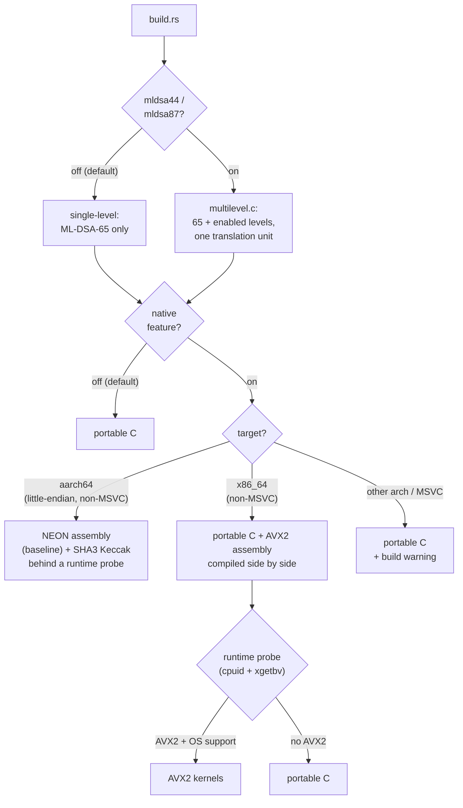
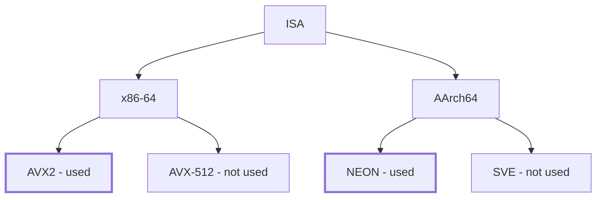

# mysten-mldsa-native-rs

> [!WARNING]
> This crate has not been audited and is not ready for production use. The API and the
> pinned upstream commit may change without notice until a release is tagged.

Minimal safe Rust wrapper around [mldsa-native]'s ML-DSA (FIPS 204) implementation -
the CBMC-verified C90 code maintained by the Post-Quantum Cryptography Alliance, Linux Foundation.
ML-DSA-65 is always compiled and re-exported at the crate root; ML-DSA-44 and ML-DSA-87 are
available behind cargo features.

This crate is the scheme-agnostic middle layer: It is designed to be consumer-agnostic (e.g. MystenLabs' fastcrypto), 
as the consumer can wrap these types and implement their own traits on top.

## Design decisions

- **Two signing key forms.** `SigningKeySeed` is the 32-byte FIPS 204 seed `/Xi` — the
  storage and wire form. `SigningKeySeed::expand` derives the operational `SigningKey`
  (4032-byte expanded key plus 1952-byte public key), where `sign` lives. FIPS 204 fixes
  the seed -> key expansion, so the same seed yields the same key pair in every compliant
  implementation. Consumers pick the space-time trade-off: store seeds and expand on
  demand, or keep expanded keys around.
- **No entropy source in the library.** The C is compiled with
  `MLD_CONFIG_NO_RANDOMIZED_API`, so its self-randomizing entry points do not exist and
  no `randombytes` symbol is required or referenced at link time. All randomness enters
  as explicit arguments: the seed for key generation, `rnd` for hedged signing.
- **The FIPS 204 context string is a parameter** (at most 255 bytes) on `sign` and
  `verify`; consumers that need no domain separation pass the empty string.
- **Strict fixed-length parsing**, and verification rejects non-canonical signature
  encodings (enforced inside the verified C); a valid ML-DSA-65 signature has exactly
  one byte encoding.
- **Hand-written FFI, no bindgen.** The `extern "C"` declarations live in `src/sys.rs`
  and are mirrored by `src/abi_check.c`, which re-declares the C prototypes and pins the
  size constants so that any ABI change on a future re-pin fails the C compile. No libclang is needed to build.
- **Single compilation unit, minimal exports.** The C builds as upstream's monolithic
  unit with `MLD_CONFIG_INTERNAL_API_QUALIFIER=static`; only the public API symbols are
  exported. The Cargo `links = "mldsa65"` key forbids any dependency graph containing a
  second copy of the C library.
- **Secret hygiene**: seed and expanded key are zeroized on drop; `SigningKey`'s `Debug`
  is redacted.
- Runtime dependency: `zeroize`. Build dependency: `cc`.

## Usage

```rust
use mysten_mldsa_native_rs::{SigningKeySeed, RND_LENGTH, SEED_LENGTH};

const MSG: &str = "00010203";
const SEED: &str = "0101010101010101010101010101010101010101010101010101010101010101";

let seed: [u8; SEED_LENGTH] = hex::decode(SEED).unwrap().try_into().unwrap();
let msg = hex::decode(MSG).unwrap();

let (sk, vk) = SigningKeySeed::from(seed).expand();
let rnd = [42u8; RND_LENGTH]; // draw fresh from the OS per signature in real use
let sig = sk.sign(&msg, b"", &rnd).unwrap();
assert!(vk.verify(&msg, b"", &sig).is_ok());
```

The same example runs as the crate's doctest, so it cannot drift from the API.

## Building

The C sources are a git submodule (see `PROVENANCE.md` for the pinned commit):

```bash
git clone --recursive <repo-url>
# or, in an existing clone:
git submodule update --init
cargo test
```

A C compiler is required; the default build compiles the portable C backend, which
works on every target. The `native` cargo feature swaps in the formally verified
assembly backends behind the same API: NEON on aarch64 and AVX2 on x86_64. Anything
that is not architecture baseline is gated per machine by a runtime CPU probe, with
automatic fallback to the portable C — AVX2 on x86_64, and the ARMv8.4-A FEAT_SHA3
Keccak kernels on aarch64 (which the compiler compiles in whenever it targets SHA3,
as Apple's clang does by default). Outputs are identical across backends; the
cross-implementation known-answer vectors in `tests/` pin the exact public key and
signature bytes and run under whichever backend is compiled. On other architectures,
and on toolchains the assembly does not support (MSVC), the feature falls back to the
portable C with a build warning.

### Parameter sets

ML-DSA-65 is always compiled and re-exported at the crate root, so `use
mysten_mldsa_native_rs::SigningKeySeed` keeps working unchanged. The `mldsa44` and
`mldsa87` features additionally compile those parameter sets and expose them as
`mysten_mldsa_native_rs::mldsa44` / `::mldsa87`, with the identical API — the levels are
generated from one implementation (`src/level.rs`) and share one test suite, so a level
cannot quietly lose coverage.

```bash
cargo build                            # ML-DSA-65 only, portable C
cargo build --features native          # ML-DSA-65, assembly backends
cargo build --features mldsa44,mldsa87 # all three levels
cargo build --all-features             # all three levels, assembly backends
```

The levels are **not** wire-compatible with each other, so choosing one is a protocol
decision, not a tuning knob. Enabling them is additive in every sense: the features
compose with `native` (one assembly unit serves every compiled level), the extra levels
add only their own code because ML-DSA-65 carries the shared FIPS202 implementation, and
nothing about the default build changes.

Internally this uses upstream's multilevel monobuild shape (`src/multilevel.c`), the same
pattern AWS-LC uses in production: one translation unit that includes the implementation
once per parameter set, with the namespacing machinery keeping each level's symbols
distinct. It replaces the single-level shims when enabled and takes over their job of
injecting the runtime capability probe.

### Backend selection

How a build decides what runs. Everything above the probe is settled by `build.rs` at
compile time; the probe is the only run-time decision, made on first use and cached.



And where those choices sit in the SIMD landscape. Upstream mldsa-native ships
backends for the two extensions that are dependable in the field; the others have no
backend to enable.



### Footprint

Everything above compiles into the calling binary, so it is worth knowing what each
feature actually costs. The figures below are the size a linked binary grows by,
measured against an otherwise identical hello-world, on aarch64 macOS with a plain
`--release` profile:

| What is compiled | Adds |
| --- | --- |
| ML-DSA-65, portable C (the default) | +67 KB |
| ML-DSA-65, assembly backends (`native`) | +85 KB |
| all three levels, portable C | +152 KB |
| all three levels, assembly backends | +187 KB |

Two things are worth reading off that table. The assembly backends cost about 18 KB
for a roughly 2.5x speedup, which is the cheapest trade here by a wide margin. And the
extra parameter sets cost less than doubling: ML-DSA-65 carries the shared FIPS202 and
Keccak code, so ML-DSA-44 and ML-DSA-87 only bring their own polynomial arithmetic.

For comparison, linking aws-lc-rs for ML-DSA-65 alone adds around 1.7 MB, because the
scheme arrives with the rest of its libcrypto. This crate compiles one algorithm and
nothing else, which is most of the difference.

Reproducing the numbers is a matter of building the same workload twice, once with the
crate and once without, and taking the difference. Turning on LTO and `strip` shrinks
every binary by roughly 130 KB, but it leaves the figures above almost unchanged, since
what it removes is mostly the Rust runtime rather than this crate's contribution.

## Relation to mldsa-native-rs

[mldsa-native-rs] wraps the same C library with a different contract: bindgen-generated bindings, all three parameter sets, RustCrypto
`signature`-trait integration, an expanded-key (4032-byte) `SigningKey` with no seed
retention, and the C's randomized API compiled in behind a `randombytes` link symbol.
This crate exists for consumers that need the opposite trade-offs: seed-as-private-key,
no build-time code generation, no entropy path in the C, zeroization, and a surface
small enough to audit in one sitting.

[mldsa-native]: https://github.com/pq-code-package/mldsa-native

## Development

The toolchain is pinned by `rust-toolchain.toml`. Before pushing:

```bash
cargo test --all-features
cargo fmt --all --check
cargo xclippy -D warnings   # project clippy alias, see .cargo/config.toml
scripts/license_check.sh
cargo deny check            # needs cargo-deny installed
```

Vulnerabilities: see `SECURITY.md` — do not open public issues.

## License

Apache-2.0. The vendored mldsa-native sources are Apache-2.0 OR ISC OR MIT (see
`deps/mldsa-native/LICENSE`).
