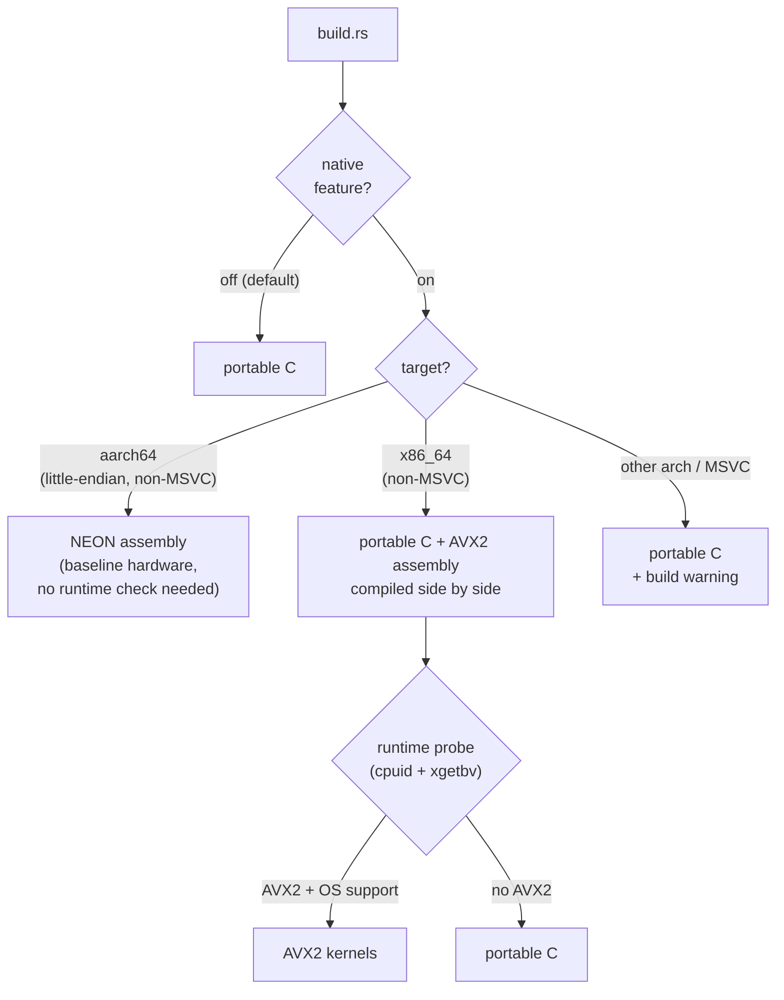
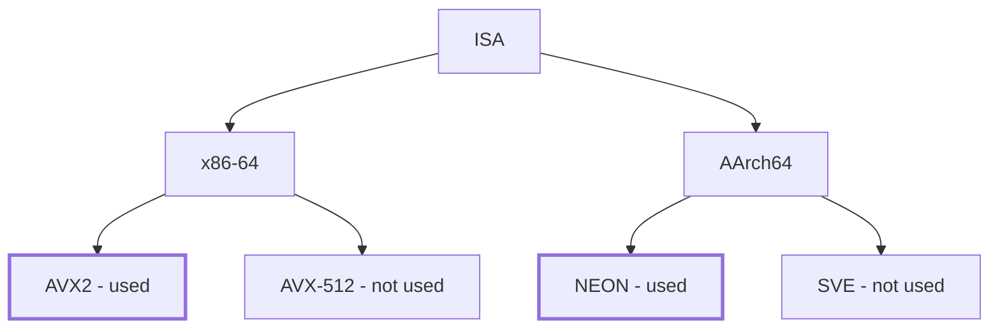

# mysten-mldsa-native-rs

Minimal safe Rust wrapper around [mldsa-native]'s ML-DSA-65 (FIPS 204) implementation -
the CBMC-verified C90 code maintained by the Post-Quantum Cryptography Alliance, Linux Foundation.

This crate is the scheme-agnostic middle layer: It is designed to be consumer-agnostic (e.g. MystenLabs' fastcrypto), 
as the consumer can wrap these types and implement their own traits on top.

## Design decisions

- **Two signing key forms.** `SigningKeySeed` is the 32-byte FIPS 204 seed `/Xi` — the
  storage and wire form. `SigningKeySeed::expand` derives the operational `SigningKey`
  (4032-byte expanded key plus 1952-byte public key), where `sign` lives. FIPS 204 fixes
  the seed -> key expansion, so the same seed yields the same key pair in every compliant
  implementation. Consumers pick the space-time trade-off: store seeds and expand on
  demand, or keep expanded keys around.
- **No entropy source in the library.** The C is compiled with
  `MLD_CONFIG_NO_RANDOMIZED_API`, so its self-randomizing entry points do not exist and
  no `randombytes` symbol is required or referenced at link time. All randomness enters
  as explicit arguments: the seed for key generation, `rnd` for hedged signing.
- **The FIPS 204 context string is a parameter** (at most 255 bytes) on `sign` and
  `verify`; consumers that need no domain separation pass the empty string.
- **Strict fixed-length parsing**, and verification rejects non-canonical signature
  encodings (enforced inside the verified C); a valid ML-DSA-65 signature has exactly
  one byte encoding.
- **Hand-written FFI, no bindgen.** The `extern "C"` declarations live in `src/sys.rs`
  and are mirrored by `src/abi_check.c`, which re-declares the C prototypes and pins the
  size constants so that any ABI change on a future re-pin fails the C compile. No libclang is needed to build.
- **Single compilation unit, minimal exports.** The C builds as upstream's monolithic
  unit with `MLD_CONFIG_INTERNAL_API_QUALIFIER=static`; only the public API symbols are
  exported. The Cargo `links = "mldsa65"` key forbids any dependency graph containing a
  second copy of the C library.
- **Secret hygiene**: seed and expanded key are zeroized on drop; `SigningKey`'s `Debug`
  is redacted.
- Runtime dependency: `zeroize`. Build dependency: `cc`.

## Usage

```rust
use mysten_mldsa_native_rs::{SigningKeySeed, RND_LENGTH, SEED_LENGTH};

const MSG: &str = "00010203";
const SEED: &str = "0101010101010101010101010101010101010101010101010101010101010101";

let seed: [u8; SEED_LENGTH] = hex::decode(SEED).unwrap().try_into().unwrap();
let msg = hex::decode(MSG).unwrap();

let sk = SigningKeySeed::from(seed).expand();
let rnd = [42u8; RND_LENGTH]; // draw fresh from the OS per signature in real use
let sig = sk.sign(&msg, b"", &rnd).unwrap();
assert!(sk.verifying_key().verify(&msg, b"", &sig).is_ok());
```

The same example runs as the crate's doctest, so it cannot drift from the API.

## Building

The C sources are a git submodule (see `PROVENANCE.md` for the pinned commit):

```bash
git clone --recursive <repo-url>
# or, in an existing clone:
git submodule update --init
cargo test
```

A C compiler is required; the default build compiles the portable C backend, which
works on every target. The `native` cargo feature swaps in the formally verified
assembly backends behind the same API: NEON on aarch64 (selected at compile time),
AVX2 on x86_64 (gated per machine by a runtime CPU probe, with automatic fallback to
the portable C on CPUs without AVX2). Outputs are identical across backends, and the
pinned test vectors verify that. On other architectures, and on toolchains the
assembly does not support (MSVC), the feature falls back to the portable C with a
build warning.

### Backend selection

How a build decides what runs. Everything above the probe is settled by `build.rs` at
compile time; the probe is the only run-time decision, made on first use and cached.



And where those choices sit in the SIMD landscape. Upstream mldsa-native ships
backends for the two extensions that are dependable in the field; the others have no
backend to enable.



## Relation to mldsa-native-rs

[mldsa-native-rs] wraps the same C library with a different contract: bindgen-generated bindings, all three parameter sets, RustCrypto
`signature`-trait integration, an expanded-key (4032-byte) `SigningKey` with no seed
retention, and the C's randomized API compiled in behind a `randombytes` link symbol.
This crate exists for consumers that need the opposite trade-offs: seed-as-private-key,
no build-time code generation, no entropy path in the C, zeroization, and a surface
small enough to audit in one sitting.

[mldsa-native]: https://github.com/pq-code-package/mldsa-native
[mldsa-native-rs]: https://gitlab.com/nisec/qubip/mldsa-native-rs

## Development

The toolchain is pinned by `rust-toolchain.toml`. Before pushing:

```bash
cargo test --all-features
cargo fmt --all --check
cargo xclippy -D warnings   # project clippy alias, see .cargo/config.toml
scripts/license_check.sh
cargo deny check            # needs cargo-deny installed
```

Vulnerabilities: see `SECURITY.md` — do not open public issues.

## License

Apache-2.0. The vendored mldsa-native sources are Apache-2.0 OR ISC OR MIT (see
`deps/mldsa-native/LICENSE`).
